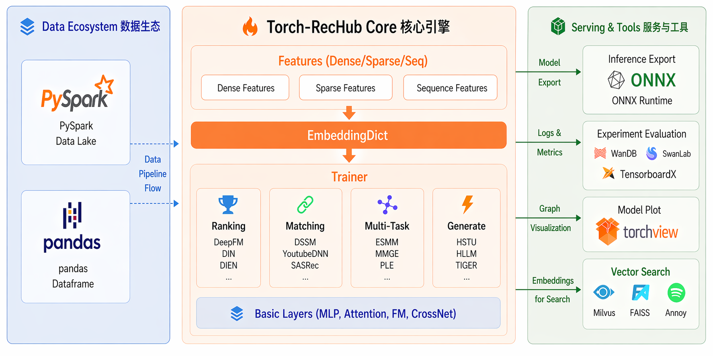

<div align="center">


# Torch-RecHub: 轻量、高效、易用的 PyTorch 推荐系统框架

[](https://pypi.org/project/torch-rechub/)
[](https://pepy.tech/projects/torch-rechub)
[](LICENSE)


[](https://www.python.org/)
[](https://pytorch.org/)
[](https://github.com/mert-kurttutan/torchview)

[English](README_en.md) | 简体中文



</div>

**在线文档：** https://datawhalechina.github.io/torch-rechub/zh/

**Torch-RecHub** —— **10 行代码实现工业级推荐系统**。30+ 主流模型开箱即用，支持一键 ONNX 部署，让你专注于业务而非工程。

## ✨ 特性

* **生成式推荐模型:** LLM时代下，可以复现部分生成式推荐模型
* **模块化设计:** 易于添加新的模型、数据集和评估指标。
* **基于 PyTorch:** 利用 PyTorch 的动态图和 GPU 加速能力，支持 NVIDIA GPU 和华为昇腾 NPU。
* **丰富的模型库:** 涵盖 **30+** 经典和前沿推荐算法（召回、排序、多任务、生成式推荐等）。
* **标准化流程:** 提供统一的数据加载、训练和评估流程。
* **易于配置:** 通过配置文件或命令行参数轻松调整实验设置。
* **可复现性:** 旨在确保实验结果的可复现性。
* **ONNX 导出:** 支持将训练好的模型导出为 ONNX 格式，便于部署到生产环境。
* **跨引擎数据处理:** 现已支持基于 PySpark 的数据处理与转换，方便在大数据管道中落地。
* **实验可视化与跟踪:** 内置 WandB、SwanLab、TensorBoardX 三种可视化/追踪工具的统一集成。

## 📖 目录

- [🔥 Torch-RecHub - 轻量、高效、易用的 PyTorch 推荐系统框架](#-torch-rechub---轻量高效易用的-pytorch-推荐系统框架)
  - [✨ 特性](#-特性)
  - [📖 目录](#-目录)
  - [🔧 安装](#-安装)
    - [环境要求](#环境要求)
    - [安装步骤](#安装步骤)
  - [🚀 快速开始](#-快速开始)
  - [📂 项目结构](#-项目结构)
  - [💡 支持的模型](#-支持的模型)
  - [📊 支持的数据集](#-支持的数据集)
  - [🧪 示例](#-示例)
    - [精排（CTR预测）](#精排ctr预测)
    - [多任务排序](#多任务排序)
    - [召回模型](#召回模型)
  - [👨‍💻‍ 贡献者](#-贡献者)
  - [🤝 贡献指南](#-贡献指南)
  - [📜 许可证](#-许可证)
  - [📚 引用](#-引用)
  - [📫 联系方式](#-联系方式)
  - [⭐️ 项目 star 历史](#️-项目-star-历史)

## 🔧 安装

### 环境要求

* Python 3.9+
* PyTorch 1.7+ (建议使用支持 CUDA 的版本以获得 GPU 加速)
* NumPy
* Pandas
* SciPy
* Scikit-learn

### 安装步骤

**稳定版（推荐用户使用）：**
```bash
# 根据设备选择对应的 PyTorch 版本
pip install torch                                                     # CPU
pip install torch --index-url https://download.pytorch.org/whl/cu121  # GPU (CUDA 12.1)
pip install torch torch-npu                                           # NPU (Huawei Ascend, 需要 torch-npu >= 2.5.1)

pip install torch-rechub
```

**最新版：**
```bash
# 首先安装 uv（如果尚未安装）
pip install uv

# 克隆并安装
git clone https://github.com/datawhalechina/torch-rechub.git
cd torch-rechub

# 根据设备选择对应的 PyTorch 版本
uv pip install torch                                                     # CPU
uv pip install torch --index-url https://download.pytorch.org/whl/cu121  # GPU (CUDA 12.1)
uv pip install torch torch-npu                                           # NPU (Huawei Ascend, 需要 torch-npu >= 2.5.1)

uv sync
```


## 🚀 快速开始

以下是一个简单的示例，展示如何在 MovieLens 数据集上训练模型（例如 DSSM）：

```bash
# 克隆仓库（如果使用最新版）
git clone https://github.com/datawhalechina/torch-rechub.git
cd torch-rechub
uv sync

# 运行召回示例（需要先进入对应目录，脚本使用相对路径加载数据）
cd examples/matching
python run_ml_dssm.py

# 或使用自定义参数：
python run_ml_dssm.py --model_name dssm --device 'cuda:0' --learning_rate 0.001 --epoch 50 --batch_size 4096 --weight_decay 0.0001 --save_dir 'saved/dssm_ml-100k'

# 运行精排示例
cd ../ranking
python run_criteo.py
```

训练完成后，模型文件将保存在 `saved/dssm_ml-100k` 目录下（或你配置的其他目录）。

## 📂 项目结构

```
torch-rechub/             # 根目录
├── README.md             # 项目文档
├── pyproject.toml        # 项目配置和依赖
├── torch_rechub/         # 核心代码库
│   ├── basic/            # 基础组件
│   │   ├── activation.py # 激活函数
│   │   ├── features.py   # 特征工程
│   │   ├── layers.py     # 神经网络层
│   │   ├── loss_func.py  # 损失函数
│   │   └── metric.py     # 评估指标
│   ├── models/           # 推荐模型实现
│   │   ├── matching/     # 召回模型（DSSM/MIND/GRU4Rec等）
│   │   ├── ranking/      # 排序模型（WideDeep/DeepFM/DIN等）
│   │   └── multi_task/   # 多任务模型（MMoE/ESMM等）
│   ├── trainers/         # 训练框架
│   │   ├── ctr_trainer.py    # CTR预测训练器
│   │   ├── match_trainer.py  # 召回模型训练器
│   │   └── mtl_trainer.py    # 多任务学习训练器
│   └── utils/            # 工具函数
│       ├── data.py       # 数据处理工具
│       ├── match.py      # 召回工具
│       ├── mtl.py        # 多任务工具
│       └── onnx_export.py # ONNX 导出工具
├── examples/             # 示例脚本
│   ├── matching/         # 召回任务示例
│   ├── ranking/          # 排序任务示例
│   └── generative/       # 生成式推荐示例（HSTU、HLLM 等）
├── docs/                 # 文档（VitePress，多语言）
├── tutorials/            # Jupyter教程
├── tests/                # 单元测试
├── config/               # 配置文件
└── scripts/              # 工具脚本
```

## 💡 支持的模型

本框架目前支持 **30+** 主流推荐模型：

<details>

### 排序模型 (Ranking Models) - 13个

| 模型          | 论文                                             | 简介                    |
| ------------- | ------------------------------------------------ | ----------------------- |
| **DeepFM**    | [IJCAI 2017](https://arxiv.org/abs/1703.04247)   | FM + Deep 联合训练      |
| **Wide&Deep** | [DLRS 2016](https://arxiv.org/abs/1606.07792)    | 记忆 + 泛化能力结合     |
| **DCN**       | [KDD 2017](https://arxiv.org/abs/1708.05123)     | 显式特征交叉网络        |
| **DCN-v2**    | [WWW 2021](https://arxiv.org/abs/2008.13535)     | 增强版交叉网络          |
| **DIN**       | [KDD 2018](https://arxiv.org/abs/1706.06978)     | 注意力机制捕捉用户兴趣  |
| **DIEN**      | [AAAI 2019](https://arxiv.org/abs/1809.03672)    | 兴趣演化建模            |
| **BST**       | [DLP-KDD 2019](https://arxiv.org/abs/1905.06874) | Transformer 序列建模    |
| **AFM**       | [IJCAI 2017](https://arxiv.org/abs/1708.04617)   | 注意力因子分解机        |
| **AutoInt**   | [CIKM 2019](https://arxiv.org/abs/1810.11921)    | 自动特征交互学习        |
| **FiBiNET**   | [RecSys 2019](https://arxiv.org/abs/1905.09433)  | 特征重要性 + 双线性交互 |
| **DeepFFM**   | [RecSys 2019](https://arxiv.org/abs/1611.00144)  | 场感知因子分解机        |
| **EDCN**      | [KDD 2021](https://arxiv.org/abs/2106.03032)     | 增强型交叉网络  
        |
</details>

<details>

### 召回模型 (Matching Models) - 12个

| 模型           | 论文                                                                           | 简介               |
| -------------- | ------------------------------------------------------------------------------ | ------------------ |
| **DSSM**       | [CIKM 2013](https://posenhuang.github.io/papers/cikm2013_DSSM_fullversion.pdf) | 经典双塔召回模型   |
| **YoutubeDNN** | [RecSys 2016](https://dl.acm.org/doi/10.1145/2959100.2959190)                  | YouTube 深度召回   |
| **YoutubeSBC** | [RecSys 2019](https://dl.acm.org/doi/10.1145/3298689.3346997)                  | 采样偏差校正版本   |
| **MIND**       | [CIKM 2019](https://arxiv.org/abs/1904.08030)                                  | 多兴趣动态路由     |
| **SINE**       | [WSDM 2021](https://arxiv.org/abs/2103.06920)                                  | 稀疏兴趣网络       |
| **GRU4Rec**    | [ICLR 2016](https://arxiv.org/abs/1511.06939)                                  | GRU 序列推荐       |
| **SASRec**     | [ICDM 2018](https://arxiv.org/abs/1808.09781)                                  | 自注意力序列推荐   |
| **NARM**       | [CIKM 2017](https://arxiv.org/abs/1711.04725)                                  | 神经注意力会话推荐 |
| **STAMP**      | [KDD 2018](https://dl.acm.org/doi/10.1145/3219819.3219895)                     | 短期注意力记忆优先 |
| **ComiRec**    | [KDD 2020](https://arxiv.org/abs/2005.09347)                                   | 可控多兴趣推荐     |

</details>

<details>

### 多任务模型 (Multi-Task Models) - 5个

| 模型             | 论文                                                          | 简介               |
| ---------------- | ------------------------------------------------------------- | ------------------ |
| **ESMM**         | [SIGIR 2018](https://arxiv.org/abs/1804.07931)                | 全空间多任务建模   |
| **MMoE**         | [KDD 2018](https://dl.acm.org/doi/10.1145/3219819.3220007)    | 多门控专家混合     |
| **PLE**          | [RecSys 2020](https://dl.acm.org/doi/10.1145/3383313.3412236) | 渐进式分层提取     |
| **AITM**         | [KDD 2021](https://arxiv.org/abs/2105.08489)                  | 自适应信息迁移     |
| **SharedBottom** | -                                                             | 经典多任务共享底层 |

</details>

<details>

### 生成式推荐 (Generative Recommendation) - 3个

| 模型      | 论文                                           | 简介                                         |
| --------- | ---------------------------------------------- | -------------------------------------------- |
| **HSTU**  | [Meta 2024](https://arxiv.org/abs/2402.17152)  | 层级序列转换单元，支撑 Meta 万亿参数推荐系统 |
| **HLLM**  | [2024](https://arxiv.org/abs/2409.12740)       | 层级大语言模型推荐，融合 LLM 语义理解能力    |
| **TIGER** | [NeurIPS 2023](https://arxiv.org/abs/2305.05065) | 基于 T5 的生成式检索推荐，语义ID序列生成   |

</details>

## 📊 支持的数据集

框架内置了对以下常见数据集格式的支持或提供了处理脚本：

* **MovieLens**
* **Amazon**
* **Criteo**
* **Avazu** 
* **Census-Income**
* **BookCrossing**
* **Ali-ccp**
* **Yidian**
* ... 

我们期望的数据格式通常是包含以下字段的交互文件：
- 用户 ID
- 物品 ID 
- 评分（可选）
- 时间戳（可选）

具体格式要求请参考 `tutorials` 目录下的示例代码。`examples/` 目录下的各场景子目录中已包含样例数据，可直接用于快速体验和调试。

你可以方便地集成你自己的数据集，只需确保它符合框架要求的数据格式，或编写自定义的数据加载器。


## 🧪 示例

所有模型使用案例参考 `/examples`


### 精排（CTR预测）

```python
from torch_rechub.models.ranking import DeepFM
from torch_rechub.trainers import CTRTrainer
from torch_rechub.utils.data import DataGenerator

dg = DataGenerator(x, y)
train_dataloader, val_dataloader, test_dataloader = dg.generate_dataloader(split_ratio=[0.7, 0.1], batch_size=256)

model = DeepFM(deep_features=deep_features, fm_features=fm_features, mlp_params={"dims": [256, 128], "dropout": 0.2, "activation": "relu"})

ctr_trainer = CTRTrainer(model)
ctr_trainer.fit(train_dataloader, val_dataloader)
auc = ctr_trainer.evaluate(ctr_trainer.model, test_dataloader)
ctr_trainer.export_onnx("deepfm.onnx")
```

### 多任务排序

```python
from torch_rechub.models.multi_task import SharedBottom, ESMM, MMOE, PLE, AITM
from torch_rechub.trainers import MTLTrainer

task_types = ["classification", "classification"] 
model = MMOE(features, task_types, 8, expert_params={"dims": [32,16]}, tower_params_list=[{"dims": [32, 16]}, {"dims": [32, 16]}])

mtl_trainer = MTLTrainer(model)
mtl_trainer.fit(train_dataloader, val_dataloader)
auc = ctr_trainer.evaluate(ctr_trainer.model, test_dataloader)
mtl_trainer.export_onnx("mmoe.onnx")
```

### 召回模型

```python
from torch_rechub.models.matching import DSSM
from torch_rechub.trainers import MatchTrainer
from torch_rechub.utils.data import MatchDataGenerator

dg = MatchDataGenerator(x, y)
train_dl, test_dl, item_dl = dg.generate_dataloader(test_user, all_item, batch_size=256)

model = DSSM(user_features, item_features, temperature=0.02,
             user_params={
                 "dims": [256, 128, 64],
                 "activation": 'prelu',  
             },
             item_params={
                 "dims": [256, 128, 64],
                 "activation": 'prelu', 
             })

match_trainer = MatchTrainer(model)
match_trainer.fit(train_dl)
match_trainer.export_onnx("dssm.onnx")
# 双塔模型可分别导出用户塔和物品塔:
# match_trainer.export_onnx("user_tower.onnx", mode="user")
# match_trainer.export_onnx("dssm_item.onnx", tower="item")
```

### 模型可视化

```python
# 可视化模型架构（需要安装: pip install torch-rechub[visualization]）
graph = ctr_trainer.visualization(depth=4)  # 生成计算图
ctr_trainer.visualization(save_path="model.pdf", dpi=300)  # 保存为高清 PDF
```

## 👨‍💻‍ 贡献者

感谢所有的贡献者！


[](https://github.com/datawhalechina/torch-rechub/graphs/contributors)

## 🤝 贡献指南

我们欢迎各种形式的贡献！请查看 [CONTRIBUTING.md](CONTRIBUTING.md) 了解详细的贡献指南。

我们也欢迎通过 [Issues](https://github.com/datawhalechina/torch-rechub/issues) 报告 Bug 或提出功能建议。

## 📜 许可证

本项目采用 [MIT 许可证](LICENSE)。

## 📚 引用

如果你在研究或工作中使用了本框架，请考虑引用：

```bibtex
@misc{torch_rechub,
    title = {Torch-RecHub},
    author = {Datawhale},
    year = {2022},
    publisher = {GitHub},
    journal = {GitHub repository},
    howpublished = {\url{https://github.com/datawhalechina/torch-rechub}},
    note = {A PyTorch-based recommender system framework providing easy-to-use and extensible solutions}
}
```

## 📫 联系方式

* **项目负责人:** [1985312383](https://github.com/1985312383) 
* [**GitHub Disscussions**](https://github.com/datawhalechina/torch-rechub/discussions)

## ⭐️ 项目 star 历史

[](https://www.star-history.com/#datawhalechina/torch-rechub&Date)

---

*最后更新: [2026-03-20]*
