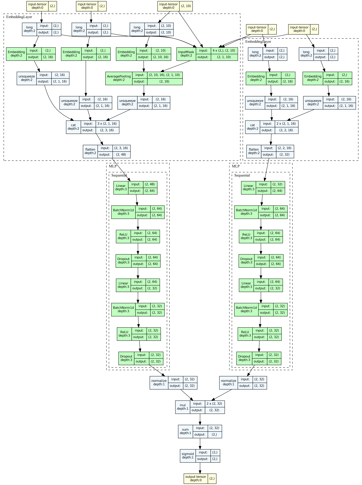

# DSSM 使用示例

## 1. 模型简介与适用场景

DSSM（Deep Structured Semantic Model）是微软在 CIKM'2013 上提出的经典双塔模型，将用户和物品分别通过各自的 DNN Tower 映射到同一向量空间，使用余弦相似度计算匹配分数。是推荐系统**召回阶段**最常用的基础模型。

**论文**: [Learning Deep Structured Semantic Models for Web Search using Clickthrough Data](https://posenhuang.github.io/papers/cikm2013_DSSM_fullversion.pdf)

### 模型结构

<div align="center">
  
</div>

- **User Tower**：将用户特征映射为向量表示
- **Item Tower**：将物品特征映射为向量表示
- **相似度计算**：通过余弦相似度 / 点积计算 User-Item 匹配分

### 适用场景

- 推荐系统召回阶段
- 大规模候选集快速筛选（向量检索）
- 搜索相关性匹配
- 双塔结构支持 User/Item 向量离线预计算，适合线上实时服务

---

## 2. 数据准备与预处理

本示例使用 **MovieLens-1M** 数据集，包含约 100 万条用户对电影的评分记录。

### 2.1 加载和处理数据

```python
import os
import numpy as np
import pandas as pd
import torch
from sklearn.preprocessing import LabelEncoder

from torch_rechub.basic.features import SparseFeature, SequenceFeature
from torch_rechub.utils.data import MatchDataGenerator, df_to_dict
from torch_rechub.utils.match import gen_model_input, generate_seq_feature_match

# 加载 MovieLens 采样数据
data = pd.read_csv("examples/matching/data/ml-1m/ml-1m_sample.csv")
data["cate_id"] = data["genres"].apply(lambda x: x.split("|")[0])

# 定义离散特征
sparse_features = ['user_id', 'movie_id', 'gender', 'age', 'occupation', 'zip', 'cate_id']
user_col, item_col = "user_id", "movie_id"
```

### 2.2 特征编码

```python
feature_max_idx = {}
for feature in sparse_features:
    lbe = LabelEncoder()
    data[feature] = lbe.fit_transform(data[feature]) + 1
    feature_max_idx[feature] = data[feature].max() + 1

# 提取用户/物品 profile
user_profile = data[["user_id", "gender", "age", "occupation", "zip"]].drop_duplicates("user_id")
item_profile = data[["movie_id", "cate_id"]].drop_duplicates("movie_id")
```

### 2.3 构建序列特征和训练数据

```python
# 生成序列特征（用户历史行为序列）和负采样
df_train, df_test = generate_seq_feature_match(
    data, user_col, item_col,
    time_col="timestamp",
    item_attribute_cols=[],
    sample_method=1,    # 随机负采样
    mode=0,             # point-wise
    neg_ratio=3,        # 负样本比例
    min_item=0
)

# 构建模型输入
x_train = gen_model_input(df_train, user_profile, user_col, item_profile, item_col, seq_max_len=50)
y_train = x_train["label"]
x_test = gen_model_input(df_test, user_profile, user_col, item_profile, item_col, seq_max_len=50)
```

### 2.4 定义特征

```python
user_cols = ['user_id', 'gender', 'age', 'occupation', 'zip']
item_cols = ['movie_id', 'cate_id']

# 用户特征 = 用户属性 + 历史行为序列
user_features = [
    SparseFeature(name, vocab_size=feature_max_idx[name], embed_dim=16)
    for name in user_cols
]
user_features += [
    SequenceFeature(
        "hist_movie_id",
        vocab_size=feature_max_idx["movie_id"],
        embed_dim=16,
        pooling="mean",           # 序列聚合方式
        shared_with="movie_id"    # 与 movie_id 共享 embedding
    )
]

# 物品特征
item_features = [
    SparseFeature(name, vocab_size=feature_max_idx[name], embed_dim=16)
    for name in item_cols
]

# 用于评估的全量物品数据
all_item = df_to_dict(item_profile)
test_user = x_test
```

### 2.5 创建 DataLoader

```python
dg = MatchDataGenerator(x=x_train, y=y_train)
train_dl, test_dl, item_dl = dg.generate_dataloader(
    test_user, all_item, batch_size=4096
)
```

---

## 3. 模型配置与参数说明

### 3.1 创建模型

```python
from torch_rechub.models.matching import DSSM

model = DSSM(
    user_features=user_features,
    item_features=item_features,
    temperature=0.02,
    user_params={
        "dims": [256, 128, 64],
        "activation": "prelu"      # PReLU 激活函数效果更好
    },
    item_params={
        "dims": [256, 128, 64],
        "activation": "prelu"
    }
)
```

### 3.2 参数详解

| 参数 | 类型 | 说明 | 建议值 |
|------|------|------|--------|
| `user_features` | `list[Feature]` | 用户侧特征列表 | 用户属性 + 行为序列 |
| `item_features` | `list[Feature]` | 物品侧特征列表 | 物品ID + 属性 |
| `temperature` | `float` | 温度系数，控制相似度分数的平滑程度 | 0.02 ~ 0.1 |
| `user_params.dims` | `list[int]` | User Tower MLP 维度 | `[256, 128, 64]` |
| `item_params.dims` | `list[int]` | Item Tower MLP 维度 | `[256, 128, 64]` |
| `*_params.activation` | `str` | 激活函数 | `"prelu"` 推荐 |

> **温度系数**: 较小的温度使模型对正负样本的区分更敏感，但训练可能不稳定。推荐从 0.02 开始调整。

---

## 4. 训练过程与代码示例

### 4.1 训练模型

```python
from torch_rechub.trainers import MatchTrainer

torch.manual_seed(2022)

trainer = MatchTrainer(
    model,
    mode=0,                        # 0: point-wise, 1: pair-wise, 2: list-wise
    optimizer_params={
        "lr": 1e-4,
        "weight_decay": 1e-6
    },
    n_epoch=10,
    device="cpu",
    model_path="./saved/dssm/"
)

trainer.fit(train_dl)
```

### 4.2 训练模式说明

| mode | 训练方式 | 损失函数 | 说明 |
|------|---------|---------|------|
| 0 | Point-wise | BCE Loss | 对每个样本独立计算 |
| 1 | Pair-wise | BPR Loss | 正负样本成对比较 |
| 2 | List-wise | Softmax Loss | 全局排序优化 |

---

## 5. 模型评估与结果分析

### 5.1 生成向量并评估

DSSM 的评估需要先生成 User 和 Item 的 Embedding 向量，再使用向量检索方式计算 Recall@K。

```python
# 生成 User Embedding
user_embedding = trainer.inference_embedding(
    model=model, mode="user",
    data_loader=test_dl,
    model_path="./saved/dssm/"
)

# 生成 Item Embedding
item_embedding = trainer.inference_embedding(
    model=model, mode="item",
    data_loader=item_dl,
    model_path="./saved/dssm/"
)

print(f"User Embedding shape: {user_embedding.shape}")
print(f"Item Embedding shape: {item_embedding.shape}")
```

### 5.2 Recall@K 评估

```python
# 需要 match_evaluation 辅助函数
# 位于 examples/matching/movielens_utils.py
from movielens_utils import match_evaluation

match_evaluation(user_embedding, item_embedding, test_user, all_item, topk=10)
```

---

## 6. 参数调优建议

### 6.1 关键调优点

1. **激活函数**: 使用 `"prelu"` 通常优于 `"relu"`（原论文推荐）
2. **温度系数**: `0.02` 是一个较好的起点
3. **Embedding 维度**: User 和 Item Tower 的最终输出维度应相同（由 dims[-1] 决定）
4. **负采样比例**: `neg_ratio=3~5` 通常效果较好
5. **学习率**: 匹配任务推荐较小的学习率 `1e-4`

### 6.2 向量检索与部署

训练完成后，需要将 Embedding 插入向量检索引擎进行 ANN（近似最近邻）搜索。Torch-RecHub 内置了对 **Annoy**、**Faiss** 和 **Milvus** 三种主流引擎的封装。

#### 方式一：Annoy（轻量级，适合快速原型）

```bash
pip install annoy
```

```python
from torch_rechub.utils.match import Annoy

# 构建 Annoy 索引
annoy = Annoy(n_trees=10, metric='angular')
annoy.fit(item_embedding)

# 为单个用户查询 Top-10 相似物品
indices, distances = annoy.query(user_embedding[0], n=10)
print(f"Top-10 Item 索引: {indices}")
print(f"对应距离: {distances}")
```

#### 方式二：Faiss（高性能，支持 GPU 加速）

```bash
pip install faiss-cpu  # 或 faiss-gpu
```

```python
from torch_rechub.utils.match import Faiss
import numpy as np

# 确保 embedding 是 float32 numpy 数组
item_emb_np = item_embedding.cpu().numpy().astype(np.float32)
user_emb_np = user_embedding.cpu().numpy().astype(np.float32)

# 创建 Faiss 索引（支持 flat / ivf / hnsw）
faiss_index = Faiss(dim=item_emb_np.shape[1], index_type='flat', metric='l2')
faiss_index.fit(item_emb_np)

# 查询 Top-10
indices, distances = faiss_index.query(user_emb_np[0], n=10)
print(f"Top-10 Item 索引: {indices}")

# 保存 / 加载索引
faiss_index.save_index("item_faiss.index")
faiss_index.load_index("item_faiss.index")
```

> **Faiss 索引类型选择**:
> | 类型 | 特点 | 适用场景 |
> |------|------|---------|
> | `flat` | 精确搜索，无需训练 | 数据量 < 100万 |
> | `ivf` | 倒排索引，需训练 | 数据量 100万~1亿 |
> | `hnsw` | 图索引，无需训练 | 高召回率需求 |

#### 方式三：Milvus（分布式，适合生产环境）

```bash
pip install pymilvus
# 需要先启动 Milvus 服务: https://milvus.io/docs/install_standalone-docker.md
```

```python
from torch_rechub.utils.match import Milvus

# 连接 Milvus 并插入 Embedding
milvus = Milvus(dim=item_embedding.shape[1], host="localhost", port="19530")
milvus.fit(item_embedding)

# 查询 Top-10
indices, distances = milvus.query(user_embedding, n=10)
```

#### 使用新版 Serving API（Builder/Indexer 模式）

项目还提供了更标准化的 `serving` 模块，统一管理不同后端：

```python
from torch_rechub.serving import builder_factory

# 使用工厂函数创建 Builder（支持 "annoy" / "faiss" / "milvus"）
builder = builder_factory("faiss", d=64, index_type="Flat", metric="L2")

# 构建索引并查询
with builder.from_embeddings(item_embedding) as indexer:
    results = indexer.query(user_embedding[:5], k=10)
    print(results.indices, results.distances)
    indexer.save("item.index")

# 从文件加载
with builder.from_index_file("item.index") as indexer:
    results = indexer.query(user_embedding[:5], k=10)
```

---

## 7. 模型可视化

Torch-RecHub 内置了基于 `torchview` 的模型结构可视化工具，可以生成模型的计算图。

### 安装依赖

```bash
pip install torch-rechub[visualization]
# 还需要安装系统级 graphviz:
# Ubuntu: sudo apt-get install graphviz
# macOS: brew install graphviz
```

### 可视化 DSSM 模型

```python
from torch_rechub.utils.visualization import visualize_model

# 自动生成输入并可视化（在 Jupyter 中直接显示）
graph = visualize_model(model, depth=4)

# 保存为图片（适合论文/文档）
visualize_model(model, save_path="dssm_architecture.png", dpi=300)

# 保存为 PDF
visualize_model(model, save_path="dssm_architecture.pdf")
```

> 可视化会自动从模型中提取特征信息生成 dummy input，无需手动构造输入数据。

---

## 8. ONNX 导出

将训练好的模型导出为 ONNX 格式，用于跨框架部署（如 ONNX Runtime、TensorRT）。

### 导出完整模型

```python
from torch_rechub.utils.onnx_export import ONNXExporter

exporter = ONNXExporter(model, device="cpu")

# 导出完整 DSSM 模型
exporter.export("dssm_full.onnx", verbose=True)
```

### 分别导出 User Tower 和 Item Tower

双塔模型可以分别导出两个 Tower，用于独立部署：

```python
# 导出 User Tower（线上实时推理）
exporter.export("dssm_user_tower.onnx", mode="user")

# 导出 Item Tower（离线批量计算）
exporter.export("dssm_item_tower.onnx", mode="item")
```

### 使用 ONNX Runtime 推理

```python
import onnxruntime as ort
import numpy as np

# 加载 User Tower
session = ort.InferenceSession("dssm_user_tower.onnx")

# 查看输入信息
for inp in session.get_inputs():
    print(f"  {inp.name}: shape={inp.shape}, type={inp.type}")

# 构造输入并推理
input_feed = {inp.name: np.zeros(inp.shape, dtype=np.int64)
              for inp in session.get_inputs()}
output = session.run(None, input_feed)
print(f"User Embedding shape: {output[0].shape}")
```

---

## 9. 常见问题与解决方案

### Q1: User Tower 和 Item Tower 的 dims 必须相同吗？
最终输出维度（`dims[-1]`）必须相同，因为需要计算相似度。中间层维度可以不同。

### Q2: 如何加入用户行为序列特征？
使用 `SequenceFeature` 定义历史行为序列，通过 `shared_with` 参数与物品 ID 共享 Embedding：

```python
SequenceFeature("hist_movie_id", vocab_size=n_movie,
                embed_dim=16, pooling="mean",
                shared_with="movie_id")
```

### Q3: 线上如何高效部署 DSSM？
关键思路是 **User 和 Item 解耦**：
1. 离线计算所有 Item Embedding，存入向量数据库（Faiss/Milvus）
2. 线上用 ONNX Runtime 实时计算 User Embedding
3. 通过 ANN 检索最相似的 Top-K Item

### Q4: temperature 设置过小会怎样？
temperature 过小会使梯度变大，训练不稳定。如果 loss 出现 NaN，尝试增大 temperature（如 0.05 → 0.1）。

### Q5: Annoy、Faiss、Milvus 如何选择？

| 特性 | Annoy | Faiss | Milvus |
|------|-------|-------|--------|
| 安装复杂度 | 简单 | 中等 | 需要服务 |
| 检索速度 | 中等 | 快（支持GPU） | 快 |
| 数据规模 | < 百万 | 亿级 | 亿级+分布式 |
| 适用场景 | 原型验证 | 生产单机 | 生产分布式 |

---

## 完整代码

```python
import os
import numpy as np
import pandas as pd
import torch
from sklearn.preprocessing import LabelEncoder

from torch_rechub.basic.features import SparseFeature, SequenceFeature
from torch_rechub.models.matching import DSSM
from torch_rechub.trainers import MatchTrainer
from torch_rechub.utils.data import MatchDataGenerator, df_to_dict
from torch_rechub.utils.match import gen_model_input, generate_seq_feature_match, Annoy


def main():
    torch.manual_seed(2022)
    save_dir = "./saved/dssm/"
    os.makedirs(save_dir, exist_ok=True)

    # 1. 数据处理
    data = pd.read_csv("examples/matching/data/ml-1m/ml-1m_sample.csv")
    data["cate_id"] = data["genres"].apply(lambda x: x.split("|")[0])
    sparse_features = ['user_id', 'movie_id', 'gender', 'age', 'occupation', 'zip', 'cate_id']
    user_col, item_col = "user_id", "movie_id"

    feature_max_idx = {}
    for feature in sparse_features:
        lbe = LabelEncoder()
        data[feature] = lbe.fit_transform(data[feature]) + 1
        feature_max_idx[feature] = data[feature].max() + 1

    user_profile = data[["user_id", "gender", "age", "occupation", "zip"]].drop_duplicates("user_id")
    item_profile = data[["movie_id", "cate_id"]].drop_duplicates("movie_id")

    # 2. 构建序列特征
    df_train, df_test = generate_seq_feature_match(
        data, user_col, item_col, time_col="timestamp",
        item_attribute_cols=[], sample_method=1, mode=0, neg_ratio=3, min_item=0
    )
    x_train = gen_model_input(df_train, user_profile, user_col, item_profile, item_col, seq_max_len=50)
    y_train = x_train["label"]
    x_test = gen_model_input(df_test, user_profile, user_col, item_profile, item_col, seq_max_len=50)

    # 3. 定义特征
    user_cols = ['user_id', 'gender', 'age', 'occupation', 'zip']
    item_cols = ['movie_id', 'cate_id']
    user_features = [SparseFeature(name, vocab_size=feature_max_idx[name], embed_dim=16) for name in user_cols]
    user_features += [SequenceFeature("hist_movie_id", vocab_size=feature_max_idx["movie_id"], embed_dim=16, pooling="mean", shared_with="movie_id")]
    item_features = [SparseFeature(name, vocab_size=feature_max_idx[name], embed_dim=16) for name in item_cols]

    all_item = df_to_dict(item_profile)
    test_user = x_test

    # 4. 创建模型
    dg = MatchDataGenerator(x=x_train, y=y_train)
    model = DSSM(user_features, item_features, temperature=0.02,
                 user_params={"dims": [256, 128, 64], "activation": "prelu"},
                 item_params={"dims": [256, 128, 64], "activation": "prelu"})

    # 5. 训练
    trainer = MatchTrainer(model, mode=0, optimizer_params={"lr": 1e-4, "weight_decay": 1e-6},
                           n_epoch=10, device="cpu", model_path=save_dir)
    train_dl, test_dl, item_dl = dg.generate_dataloader(test_user, all_item, batch_size=4096)
    trainer.fit(train_dl)

    # 6. 生成 Embedding
    user_embedding = trainer.inference_embedding(model=model, mode="user", data_loader=test_dl, model_path=save_dir)
    item_embedding = trainer.inference_embedding(model=model, mode="item", data_loader=item_dl, model_path=save_dir)
    print(f"User Embedding: {user_embedding.shape}, Item Embedding: {item_embedding.shape}")

    # 7. 使用 Annoy 进行向量召回
    annoy = Annoy(n_trees=10)
    annoy.fit(item_embedding)
    for i in range(min(5, len(user_embedding))):
        indices, distances = annoy.query(user_embedding[i], n=10)
        print(f"User {i} -> Top-10 Items: {indices}")


if __name__ == "__main__":
    main()
```
