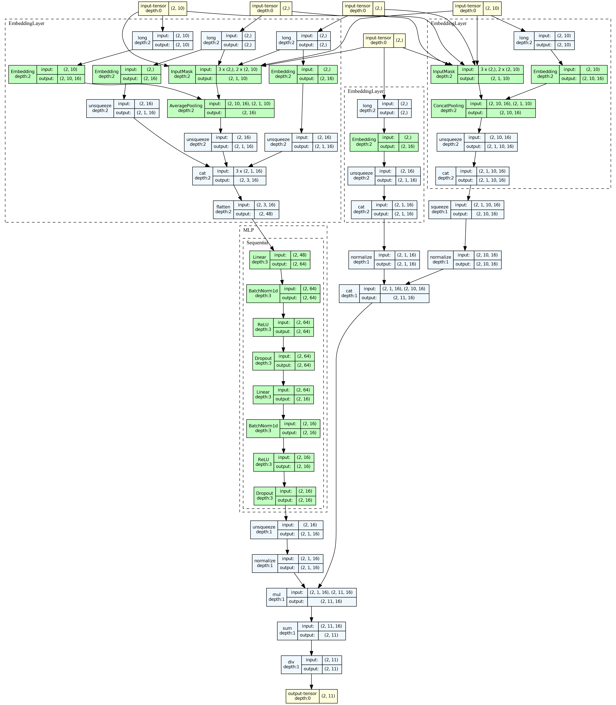

# YoutubeDNN 使用示例

## 1. 模型简介与适用场景

YoutubeDNN 是 Google 在 RecSys'2016 上提出的深度神经网络召回模型，是 Youtube 推荐系统的核心组件之一。与 DSSM 不同，YoutubeDNN 采用 **list-wise 训练方式**（Softmax 全局排序），在原始论文中 Item Tower 直接使用 Embedding 而不经过 DNN。

**论文**: [Deep Neural Networks for YouTube Recommendations](https://dl.acm.org/doi/10.1145/2959100.2959190)

### 模型结构

<div align="center">
  
</div>

- **User Tower**: 将用户属性和行为序列通过 DNN 映射为用户 Embedding
- **Item Tower**: 直接使用物品 Embedding（不经过 DNN）
- **训练方式**: 使用 Softmax + 负采样的 list-wise 训练
- **负采样**: 同一 batch 内的其他 item 作为负样本

### 适用场景

- 大规模候选集召回
- 用户行为序列较丰富的场景
- 视频/内容推荐系统
- 需要 list-wise 排序优化的场景

---

## 2. 数据准备与预处理

使用 **MovieLens-1M** 数据集。YoutubeDNN 使用 `mode=2` 生成 list-wise 训练数据，包含正样本和多个负样本。

```python
import os
import numpy as np
import pandas as pd
import torch
from sklearn.preprocessing import LabelEncoder

from torch_rechub.basic.features import SparseFeature, SequenceFeature
from torch_rechub.utils.data import MatchDataGenerator, df_to_dict
from torch_rechub.utils.match import gen_model_input, generate_seq_feature_match

data = pd.read_csv("examples/matching/data/ml-1m/ml-1m_sample.csv")
data["cate_id"] = data["genres"].apply(lambda x: x.split("|")[0])

sparse_features = ['user_id', 'movie_id', 'gender', 'age', 'occupation', 'zip', 'cate_id']
user_col, item_col = "user_id", "movie_id"

feature_max_idx = {}
for feature in sparse_features:
    lbe = LabelEncoder()
    data[feature] = lbe.fit_transform(data[feature]) + 1
    feature_max_idx[feature] = data[feature].max() + 1

user_profile = data[["user_id", "gender", "age", "occupation", "zip"]].drop_duplicates("user_id")
item_profile = data[["movie_id", "cate_id"]].drop_duplicates("movie_id")

# mode=2: list-wise 负采样，负样本保存在 "neg_items" 列
df_train, df_test = generate_seq_feature_match(
    data, user_col, item_col,
    time_col="timestamp",
    item_attribute_cols=[],
    sample_method=1,
    mode=2,           # list-wise 模式
    neg_ratio=3,
    min_item=0
)

x_train = gen_model_input(df_train, user_profile, user_col, item_profile, item_col, seq_max_len=50)
# list-wise 训练：label 固定为 0 表示第一个位置是正样本
y_train = np.array([0] * df_train.shape[0])
x_test = gen_model_input(df_test, user_profile, user_col, item_profile, item_col, seq_max_len=50)
```

### 定义特征

```python
user_cols = ['user_id', 'gender', 'age', 'occupation', 'zip']

# User 特征 = 用户属性 + 历史行为序列
user_features = [
    SparseFeature(name, vocab_size=feature_max_idx[name], embed_dim=16)
    for name in user_cols
]
user_features += [
    SequenceFeature("hist_movie_id", vocab_size=feature_max_idx["movie_id"],
                    embed_dim=16, pooling="mean", shared_with="movie_id")
]

# Item 特征（仅 movie_id Embedding）
item_features = [
    SparseFeature("movie_id", vocab_size=feature_max_idx["movie_id"], embed_dim=16)
]

# 负样本特征
neg_item_feature = [
    SequenceFeature("neg_items", vocab_size=feature_max_idx["movie_id"],
                    embed_dim=16, pooling="concat", shared_with="movie_id")
]

all_item = df_to_dict(item_profile)
test_user = x_test

# 创建 DataLoader
dg = MatchDataGenerator(x=x_train, y=y_train)
train_dl, test_dl, item_dl = dg.generate_dataloader(test_user, all_item, batch_size=2048)
```

---

## 3. 模型配置与参数说明

### 3.1 创建模型

```python
from torch_rechub.models.matching import YoutubeDNN

model = YoutubeDNN(
    user_features=user_features,
    item_features=item_features,
    neg_item_feature=neg_item_feature,
    user_params={"dims": [128, 64, 16]},
    temperature=0.02
)
```

### 3.2 参数详解

| 参数 | 类型 | 说明 | 建议值 |
|------|------|------|--------|
| `user_features` | `list[Feature]` | 用户侧特征 | 用户属性 + 序列 |
| `item_features` | `list[Feature]` | 正样本物品特征 | 物品 ID |
| `neg_item_feature` | `list[Feature]` | 负样本物品特征 | 使用 SequenceFeature + `pooling="concat"` |
| `user_params.dims` | `list[int]` | User Tower MLP 维度 | `[128, 64, 16]` |
| `temperature` | `float` | 温度系数 | 0.02 ~ 0.1 |

> **注意**: `neg_item_feature` 的 `shared_with` 参数必须与 `item_features` 中的物品 ID 特征名一致，确保正负样本共享 Embedding。

---

## 4. 训练过程与代码示例

```python
from torch_rechub.trainers import MatchTrainer

torch.manual_seed(2022)

trainer = MatchTrainer(
    model,
    mode=2,                     # list-wise 训练模式
    optimizer_params={
        "lr": 1e-4,
        "weight_decay": 1e-6
    },
    n_epoch=10,
    device="cpu",
    model_path="./saved/youtube_dnn/"
)

trainer.fit(train_dl)
```

### DSSM vs YoutubeDNN 训练模式

| 对比项 | DSSM (mode=0) | YoutubeDNN (mode=2) |
|--------|--------------|---------------------|
| 训练方式 | Point-wise (BCE) | List-wise (Softmax) |
| 负采样 | 独立负样本 | 正样本 + 多个负样本组成列表 |
| 标签 | 0/1 | 固定为 0（表示列表中第一个是正样本） |

---

## 5. 模型评估与结果分析

```python
# 生成向量
user_embedding = trainer.inference_embedding(
    model=model, mode="user",
    data_loader=test_dl,
    model_path="./saved/youtube_dnn/"
)
item_embedding = trainer.inference_embedding(
    model=model, mode="item",
    data_loader=item_dl,
    model_path="./saved/youtube_dnn/"
)

print(f"User Embedding: {user_embedding.shape}")
print(f"Item Embedding: {item_embedding.shape}")
```

---

## 6. 参数调优建议

1. **User Tower 维度**: YoutubeDNN 的 User Tower 维度逐层递减（如 `[128, 64, 16]`），最终维度决定 Embedding 大小
2. **负采样数量**: `neg_ratio=3~10`，更多负样本通常能提高效果但增加训练时间
3. **序列长度**: `seq_max_len=50` 是一个好的起点，可以根据用户行为数据的实际分布调整
4. **温度系数**: 与 DSSM 类似，`0.02` 是推荐起点

### 6.1 向量检索与部署

与 DSSM 一样，YoutubeDNN 训练完成后需要将 Embedding 插入向量索引进行 ANN 检索。

```python
from torch_rechub.utils.match import Annoy, Faiss

# 方式一：Annoy（快速原型）
annoy = Annoy(n_trees=10)
annoy.fit(item_embedding)
indices, distances = annoy.query(user_embedding[0], n=10)

# 方式二：Faiss（高性能）
import numpy as np
item_emb_np = item_embedding.cpu().numpy().astype(np.float32)
faiss_index = Faiss(dim=item_emb_np.shape[1], index_type='flat', metric='l2')
faiss_index.fit(item_emb_np)
indices, distances = faiss_index.query(user_embedding[0].cpu().numpy().astype(np.float32), n=10)

# 保存索引供线上使用
faiss_index.save_index("youtube_dnn_item.index")
```

> **更多向量检索细节**请参考 [DSSM 教程的向量检索部分](/zh/tutorials/models/matching/dssm#62-向量检索与部署)，包含 Milvus 和 Serving API 的使用方法。

---

## 7. 模型可视化

```python
from torch_rechub.utils.visualization import visualize_model

# 自动生成输入并可视化
graph = visualize_model(model, depth=4)

# 保存为图片
visualize_model(model, save_path="youtube_dnn_arch.png", dpi=300)
```

> 安装依赖：`pip install torch-rechub[visualization]` + 系统安装 graphviz

---

## 8. ONNX 导出

```python
from torch_rechub.utils.onnx_export import ONNXExporter

exporter = ONNXExporter(model, device="cpu")

# 分别导出 User / Item Tower
exporter.export("youtube_user_tower.onnx", mode="user")
exporter.export("youtube_item_tower.onnx", mode="item")
```

---

## 9. 常见问题与解决方案

### Q1: YoutubeDNN 和 DSSM 的主要区别？
- **训练方式不同**: DSSM 是 point-wise，YoutubeDNN 是 list-wise
- **Item Tower 不同**: DSSM 的 Item Tower 有 DNN，YoutubeDNN 的 Item Tower 只用 Embedding
- **损失函数不同**: DSSM 用 BCE，YoutubeDNN 用 Softmax

### Q2: 为什么 y_train 全是 0？
在 list-wise (mode=2) 训练中，标签 `0` 表示列表中**第一个位置**是正样本。模型需要学习从负样本中将正样本排在第一位。

### Q3: neg_item_feature 的 pooling 为什么用 "concat"？
因为负样本是一个列表（多个 item），`pooling="concat"` 将它们拼接为 `[batch_size, n_neg, embed_dim]` 的张量，用于 list-wise 计算。

### Q4: 如何导出 ONNX 用于线上部署？
使用 `ONNXExporter` 分别导出 User Tower 和 Item Tower，线上用 ONNX Runtime 推理 User Tower，配合向量索引（Faiss/Milvus）检索物品。

---

## 完整代码

```python
import os
import numpy as np
import pandas as pd
import torch
from sklearn.preprocessing import LabelEncoder

from torch_rechub.basic.features import SparseFeature, SequenceFeature
from torch_rechub.models.matching import YoutubeDNN
from torch_rechub.trainers import MatchTrainer
from torch_rechub.utils.data import MatchDataGenerator, df_to_dict
from torch_rechub.utils.match import gen_model_input, generate_seq_feature_match, Annoy


def main():
    torch.manual_seed(2022)
    save_dir = "./saved/youtube_dnn/"
    os.makedirs(save_dir, exist_ok=True)

    data = pd.read_csv("examples/matching/data/ml-1m/ml-1m_sample.csv")
    data["cate_id"] = data["genres"].apply(lambda x: x.split("|")[0])
    sparse_features = ['user_id', 'movie_id', 'gender', 'age', 'occupation', 'zip', 'cate_id']
    user_col, item_col = "user_id", "movie_id"

    feature_max_idx = {}
    for feature in sparse_features:
        lbe = LabelEncoder()
        data[feature] = lbe.fit_transform(data[feature]) + 1
        feature_max_idx[feature] = data[feature].max() + 1

    user_profile = data[["user_id", "gender", "age", "occupation", "zip"]].drop_duplicates("user_id")
    item_profile = data[["movie_id", "cate_id"]].drop_duplicates("movie_id")

    df_train, df_test = generate_seq_feature_match(
        data, user_col, item_col, time_col="timestamp",
        item_attribute_cols=[], sample_method=1, mode=2, neg_ratio=3, min_item=0
    )
    x_train = gen_model_input(df_train, user_profile, user_col, item_profile, item_col, seq_max_len=50)
    y_train = np.array([0] * df_train.shape[0])
    x_test = gen_model_input(df_test, user_profile, user_col, item_profile, item_col, seq_max_len=50)

    user_cols = ['user_id', 'gender', 'age', 'occupation', 'zip']
    user_features = [SparseFeature(name, vocab_size=feature_max_idx[name], embed_dim=16) for name in user_cols]
    user_features += [SequenceFeature("hist_movie_id", vocab_size=feature_max_idx["movie_id"], embed_dim=16, pooling="mean", shared_with="movie_id")]
    item_features = [SparseFeature("movie_id", vocab_size=feature_max_idx["movie_id"], embed_dim=16)]
    neg_item_feature = [SequenceFeature("neg_items", vocab_size=feature_max_idx["movie_id"], embed_dim=16, pooling="concat", shared_with="movie_id")]

    all_item = df_to_dict(item_profile)
    test_user = x_test

    dg = MatchDataGenerator(x=x_train, y=y_train)
    model = YoutubeDNN(user_features, item_features, neg_item_feature, user_params={"dims": [128, 64, 16]}, temperature=0.02)

    trainer = MatchTrainer(model, mode=2, optimizer_params={"lr": 1e-4, "weight_decay": 1e-6},
                           n_epoch=10, device="cpu", model_path=save_dir)

    train_dl, test_dl, item_dl = dg.generate_dataloader(test_user, all_item, batch_size=2048)
    trainer.fit(train_dl)

    user_embedding = trainer.inference_embedding(model=model, mode="user", data_loader=test_dl, model_path=save_dir)
    item_embedding = trainer.inference_embedding(model=model, mode="item", data_loader=item_dl, model_path=save_dir)
    print(f"User Embedding: {user_embedding.shape}, Item Embedding: {item_embedding.shape}")

    # 向量召回
    annoy = Annoy(n_trees=10)
    annoy.fit(item_embedding)
    for i in range(min(5, len(user_embedding))):
        indices, distances = annoy.query(user_embedding[i], n=10)
        print(f"User {i} -> Top-10 Items: {indices}")


if __name__ == "__main__":
    main()
```

